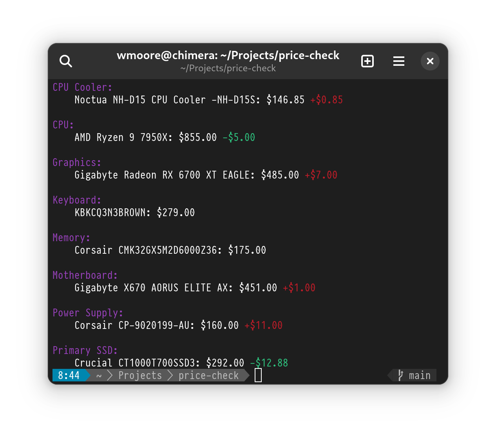

pc-price-check
==============

`pc-price-check` checks the price of PC components on staticICE against
reference prices so you can see when they drop/are on special.

This was a kind of one of thing that I made, as a result the parts list it hard
coded. Tweak to your own list as needed.

If you pass `-l` the list of components and their reference prices will be
printed.
